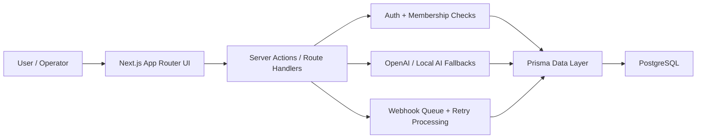
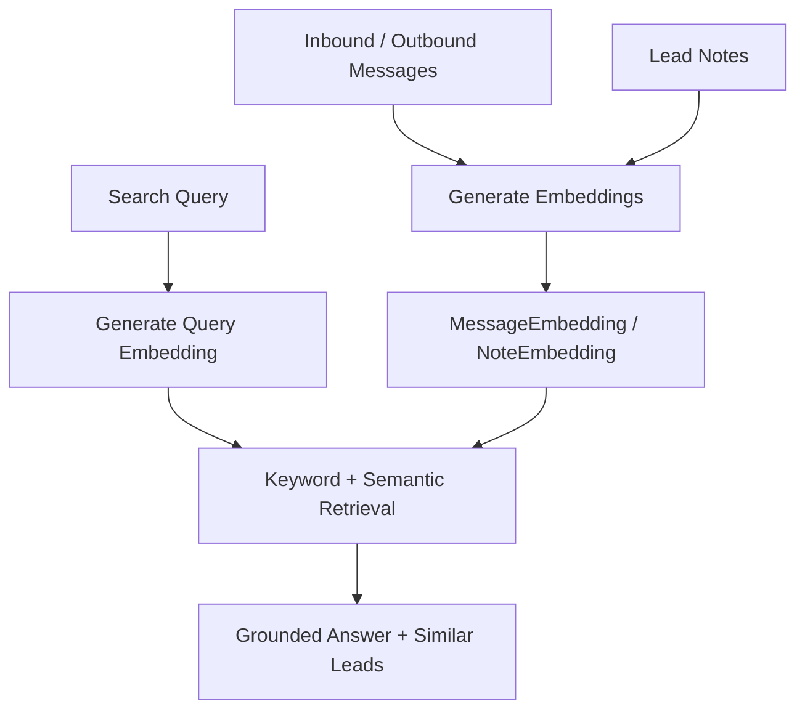
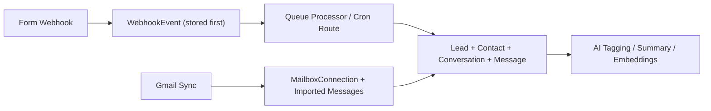
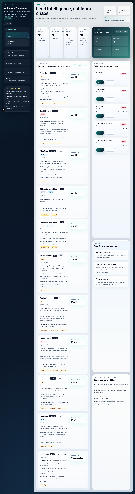
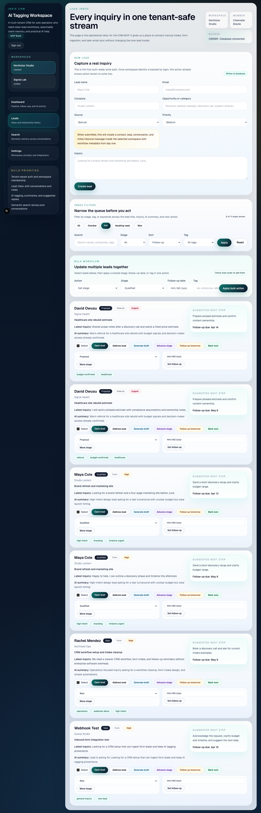
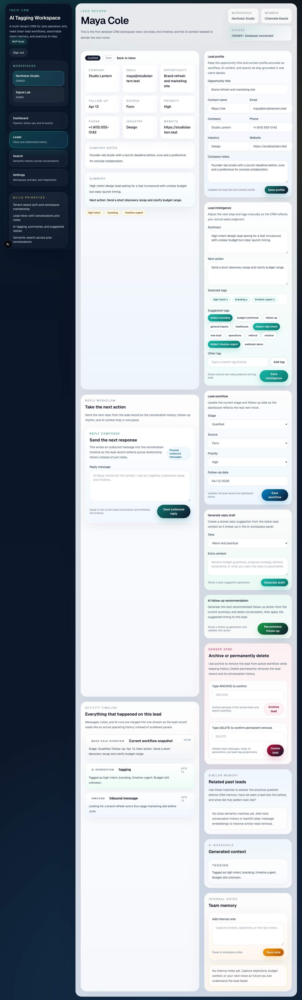
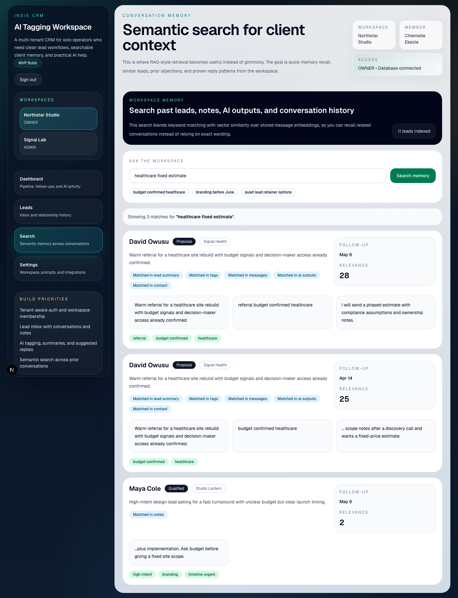
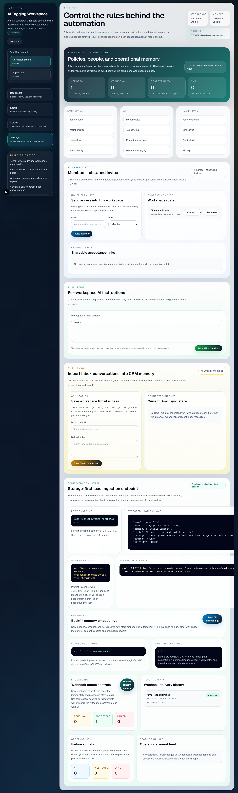

# Indie CRM with AI Tagging

A multi-tenant AI-assisted CRM for solo operators that turns unstructured lead conversations into searchable, actionable client intelligence.

This project is intentionally built as a believable SaaS case study instead of an isolated AI demo. The app focuses on real lead workflow, tenant-safe data access, provenance-aware AI features, searchable memory, and integration patterns that look like production software.

## Product Framing

Indie CRM is designed for freelancers, consultants, creators, and small agencies who need a lightweight system to:

- capture inbound leads from manual entry, webhooks, and Gmail sync
- manage conversations, notes, follow-up timing, and pipeline state
- use AI for tagging, summaries, reply suggestions, and follow-up guidance
- search prior client memory semantically instead of relying on exact keywords
- operate inside a multi-tenant workspace model with roles, auditability, and queue-backed integrations

## What The App Demonstrates

- Multi-tenant SaaS architecture with workspace-scoped queries
- Credential auth plus workspace membership and invite flows
- Lead inbox, lead detail workflow, notes, reply composition, and quick actions
- AI provenance storage through `AIGeneration`
- Webhook ingestion with storage-first queue handling and scheduled processing
- Gmail connection and sync groundwork
- Semantic search with stored embeddings, grounded answers, and similar-lead retrieval
- Audit logs and operational events for credibility beyond the UI layer

## Core Features

- Authentication with email/password credentials
- Workspace ownership, membership roles, and invite acceptance flow
- Lead creation, editing, notes, outbound replies, follow-up scheduling, and inbox views
- AI lead tagging, summaries, reply drafts, follow-up recommendations, and grounded memory answers
- Embedding storage for messages and notes, semantic search, and similar-lead retrieval
- Form webhook ingestion endpoint with queue processing and Vercel cron support
- Gmail mailbox connection and manual sync path
- Audit log and operational-event tracking for workflow, AI, webhook, and sync activity

## Tech Stack

- Next.js App Router
- TypeScript
- React 19
- Prisma
- PostgreSQL
- NextAuth/Auth.js credentials provider
- OpenAI API for generation and embeddings, with deterministic local fallbacks
- Tailwind CSS
- Vercel cron configuration via `vercel.json`

## Architecture

### Request And Data Flow



### Memory And Retrieval Flow



### Integration Flow



## Data Model Highlights

Key models:

- `Tenant`
- `User`
- `Membership`
- `WorkspaceInvite`
- `Contact`
- `Lead`
- `Conversation`
- `Message`
- `Note`
- `Tag`
- `LeadTag`
- `WebhookEvent`
- `MailboxConnection`
- `AIGeneration`
- `MessageEmbedding`
- `NoteEmbedding`
- `AuditLog`
- `OperationalEvent`

Important architectural choices in the schema:

- Every business record is tenant-scoped through `tenantId`
- AI output is stored in `AIGeneration` with `type`, `model`, `promptVersion`, `inputSummary`, `outputText`, and `metadata`
- Webhook processing is durable enough to retry through `WebhookEvent.status`, `retryCount`, `maxRetries`, `lastAttemptAt`, and `nextRetryAt`
- Searchable memory is stored explicitly through `MessageEmbedding` and `NoteEmbedding`
- Workflow credibility is supported through `AuditLog` and `OperationalEvent`

## Local Setup

### 1. Install dependencies

```bash
npm install
```

### 2. Create environment variables

Use [`app/.env.example`](/Users/user/Downloads/Indie%20CRM%20with%20AI%20Tagging/app/.env.example) as the starting point.

Minimum useful variables:

```env
DATABASE_URL="postgresql://user@localhost:5432/indie_crm?schema=public"
AUTH_SECRET="replace-with-a-long-random-secret"
DEMO_USER_PASSWORD="demo12345"
OPENAI_API_KEY=""
OPENAI_MODEL="gpt-5-mini"
OPENAI_EMBEDDING_MODEL="text-embedding-3-small"
FORM_WEBHOOK_SECRET=""
INTERNAL_CRON_SECRET=""
CRON_SECRET=""
```

Notes:

- If `OPENAI_API_KEY` is missing, the app falls back to deterministic local AI/embedding behavior so the workflow still works.
- If `FORM_WEBHOOK_SECRET` is set, form webhook callers must send `x-indie-crm-secret`.
- `CRON_SECRET` is used by the Vercel cron route.

### 3. Generate the Prisma client

```bash
npm run db:generate
```

### 4. Push the schema

```bash
npm run db:push
```

### 5. Seed the demo workspace

```bash
npm run db:seed
```

### 6. Start the app

```bash
npm run dev
```

Open [http://localhost:3000](http://localhost:3000).

### 7. Run the lightweight test suite

```bash
npm run test
```

## Demo Credentials

When seeded, the default demo login is:

- Email: `owner@northstarstudio.test`
- Password: `demo12345`

If you change `DEMO_USER_PASSWORD`, use that value instead.

## Seeded Demo Scenarios

The seed data now includes two real workspaces for the same user:

- `northstar-studio`
- `signal-lab`

Inside those workspaces, the seeded records are intentionally varied so the portfolio demo feels like a working CRM instead of a single happy-path inbox:

- high-intent branding inquiry with timeline pressure
- healthcare proposal with confirmed budget
- stalled follow-up retainer lead
- operations-focused CRM workflow inquiry
- historical lost lead
- second-workspace qualified and won leads for workspace switching

That mix supports better screenshots, more believable saved views, and clearer multi-tenant demos.

## Operational Endpoints

### Public form webhook

`POST /api/webhooks/forms/:workspaceSlug`

Example payload:

```json
{
  "name": "Maya Cole",
  "email": "maya@studiolantern.com",
  "company": "Studio Lantern",
  "title": "Brand refresh and marketing site",
  "message": "Looking for a brand refresh and a four-page site before June.",
  "source": "FORM",
  "priority": "HIGH"
}
```

### Internal queue processor

`POST /api/internal/process-webhooks?workspaceSlug=northstar-studio&limit=20`

Header:

```http
x-internal-secret: YOUR_INTERNAL_CRON_SECRET
```

### Vercel cron processor

`GET /api/cron/process-webhooks`

Header:

```http
Authorization: Bearer YOUR_CRON_SECRET
```

Configured schedule in [`app/vercel.json`](/Users/user/Downloads/Indie%20CRM%20with%20AI%20Tagging/app/vercel.json):

```json
{
  "crons": [
    {
      "path": "/api/cron/process-webhooks",
      "schedule": "0 8 * * *"
    }
  ]
}
```

## Search And Memory

The search experience combines:

- keyword scoring across summaries, tags, notes, AI outputs, and contact context
- semantic matching over stored message and note embeddings
- grounded answer generation from retrieved workspace evidence
- similar-lead retrieval on lead detail
- deep links from search snippets back into the relevant lead record

If you are testing locally with an empty OpenAI key, embeddings still work through a deterministic fallback vectorizer so the UX remains demonstrable.

## Gmail Sync

The app includes Gmail connection and sync scaffolding:

- stores mailbox connections per tenant
- tracks sync attempts, errors, and last successful sync time
- imports messages into existing CRM entities
- dedupes imported mail using `externalMessageId`
- updates embeddings and AI intelligence for newly created CRM records

## Engineering Decisions

### Every business query is scoped by tenant

The project treats tenant isolation as a baseline design rule, not a cleanup step. Queries for leads, contacts, notes, webhook events, embeddings, audit logs, and mailbox connections are scoped by workspace membership or tenant slug.

### Webhooks are stored before processing

Form submissions first become `WebhookEvent` rows. That gives the system a retry surface, an audit trail, and a cleaner path toward external workers or platform queues.

### AI outputs are stored with provenance

Generations are not ephemeral UI artifacts. The app persists model name, prompt version, summarized input, output text, and metadata so the user can inspect what happened later.

### Embeddings are regenerated when searchable content changes

New inbound and outbound messages trigger embedding writes automatically, and the app exposes a backfill path for older records. This keeps semantic search tied to actual CRM history instead of a one-off indexing step.

## Portfolio Screenshots

Captured from the seeded demo workspace on the current build:

### Workspace dashboard



### Lead inbox



### Lead detail



### Search and memory



### Settings and integrations



## Testing And Validation

Current validation path:

- `npm run lint`
- seeded workspace login
- manual lead creation and reply flow
- webhook submission against `/api/webhooks/forms/:workspaceSlug`
- queue processing through internal and cron routes
- embedding backfill through Settings

The remaining polish item after this README is to add more explicit automated tests for filtering, lead actions, and core server-side integration flows.
